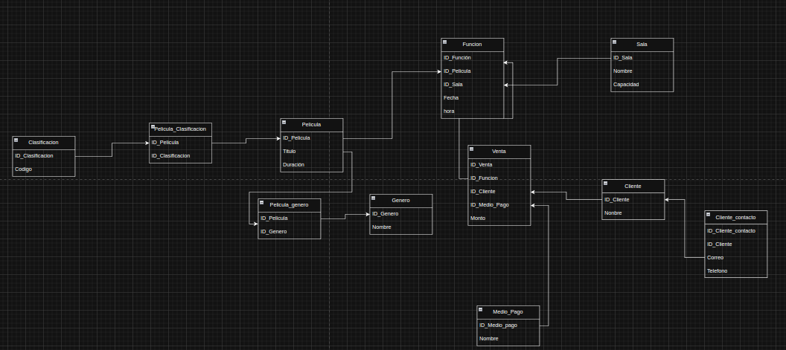

# Examen_introduccion_al_backend

# Sistema de Cine – Base de Datos

## Descripción
Proyecto de base de datos para un cine que gestiona películas, funciones, salas, clientes y ventas.  
El diseño parte de una tabla plana y se normaliza hasta **Tercera Forma Normal (3FN)**.

---

## Modelo conceptual
**Entidades principales:**
- Película
- Función
- Sala
- Cliente
- Venta
- Medio de pago
- Género
- Clasificación

**Relaciones clave:**
- Una película tiene muchas funciones.
- Una sala puede tener muchas funciones.
- Un cliente puede realizar muchas ventas.
- Una función puede tener muchas ventas.
- Un medio de pago se usa en muchas ventas.

---

## Normalización
- **1FN:** datos atómicos, sin campos repetidos.
- **2FN:** separación de entidades (película, sala, cliente, venta, etc.).
- **3FN:** eliminación de dependencias transitivas usando catálogos y tablas puente.

Resultado: datos sin redundancia y consistentes.

---

## Modelo lógico (3FN)

**Película**
- ID_Pelicula (PK)
- Titulo
- Duracion

**Género**
- ID_Genero (PK)
- Nombre

**Clasificación**
- ID_Clasificacion (PK)
- Codigo

**Sala**
- ID_Sala (PK)
- Nombre
- Capacidad

**Función**
- ID_Funcion (PK)
- ID_Pelicula (FK)
- ID_Sala (FK)
- Fecha
- Hora

**Cliente**
- ID_Cliente (PK)
- Nombre

**Cliente_Contacto**
- ID_Cliente_Contacto (PK)
- ID_Cliente (FK)
- Correo
- Telefono

**Medio_Pago**
- ID_Medio_Pago (PK)
- Nombre

**Venta**
- ID_Venta (PK)
- ID_Funcion (FK)
- ID_Cliente (FK)
- ID_Medio_Pago (FK)
- Monto

---

## Objetivo del diseño
Garantizar integridad de los datos, evitar duplicados y facilitar consultas claras sobre ventas, funciones y clientes.

## modelo conceptual 

## modelo Logico 

